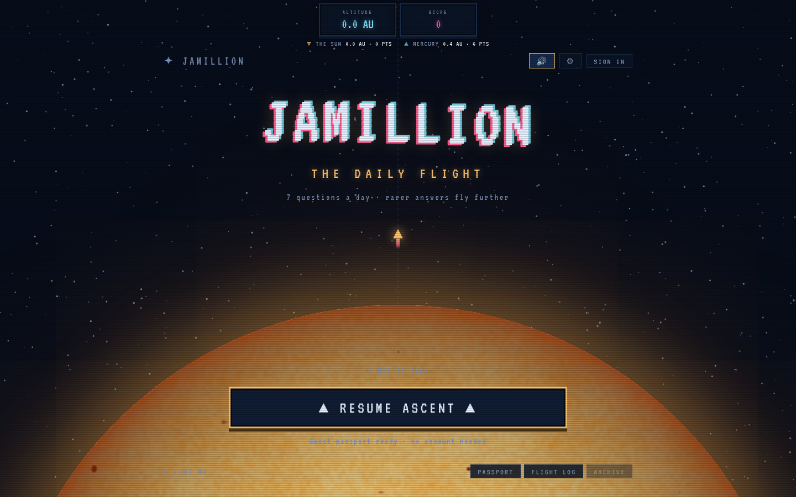
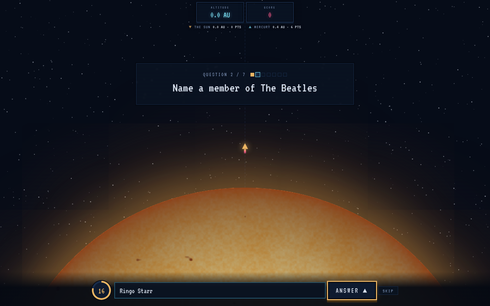
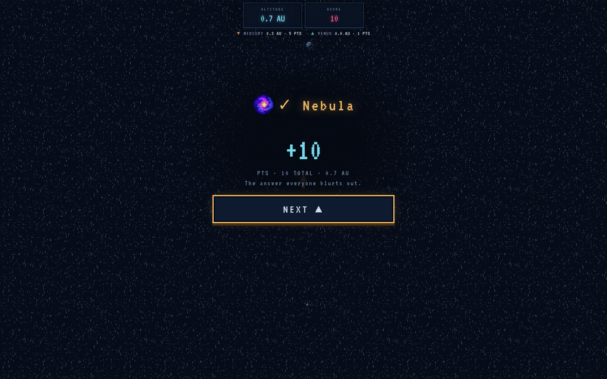

<p align="center">
  <a href="docs/img/launchpad.png"></a>
</p>

<h1 align="center">Jamillion</h1>

<p align="center">
  <b>A daily music trivia game where the rarest right answer flies furthest.</b><br>
  Seven questions. One flight from the Sun. The rarer your correct answer among today's pilots, the further out you land.
</p>

<p align="center">
  <a href="https://github.com/en1y/jamillion/actions/workflows/ci.yml"></a>
  <a href="https://github.com/en1y/jamillion/tags"></a>
  <a href="https://hub.docker.com/r/en1y/jamillion-backend"></a>
</p>

<p align="center">
  <a href="#run-it">Run it</a> ·
  <a href="#how-it-plays">How it plays</a> ·
  <a href="#the-flight-deck">The flight deck</a> ·
  <a href="#stack">Stack</a> ·
  <a href="#development">Development</a> ·
  <a href="docs/RUNNING.md">Docs</a>
</p>

---

Jamillion is in the spirit of [Krillion](https://krillion.io), but exclusively about music, and instead of diving into the ocean you launch from the Sun and fly toward the edge of the solar system. Every day at 04:00 UTC the same seven prompts go up for everyone. Name a Coldplay album and you score by how few other pilots named the same one. Hear ten seconds of a song and name the artist, the title and the record. A perfect run always lands on Pluto.

It is self-hosted, self-contained and ready for strangers: one compose file brings up the database, auth, the API and the site on a single origin, and the first visit is a setup page rather than a config file.

## Run it

```bash
mkdir jamillion && cd jamillion
curl -fsSLO https://raw.githubusercontent.com/en1y/jamillion/main/compose.yaml
docker compose up -d
```

`docker compose up -d` pulls three public images straight from Docker Hub — [`en1y/jamillion-backend`](https://hub.docker.com/r/en1y/jamillion-backend), [`en1y/jamillion-db`](https://hub.docker.com/r/en1y/jamillion-db), [`en1y/jamillion-web`](https://hub.docker.com/r/en1y/jamillion-web) — plus Supabase's own `gotrue` and `postgrest` images. No `docker login`, no build.

Open **http://localhost:8000**. The first visit is the setup page: create the admin account, paste a free [Last.fm API key](https://www.last.fm/api/account/create), choose how many artists to seed, launch. The catalog fills in the background while you write the first day's questions.

To serve it on a real hostname with HTTPS, put four lines in a `.env` beside `compose.yaml` and run the same command. Caddy fetches the certificate itself.

```
SITE_ADDRESS=https://jamillion.example.com
HTTP_PORT=80
HTTPS_PORT=443
COOKIE_SECURE=true
```

No secrets go into any file. The JWT secret and database password are generated on first boot into a volume, and the catalog keys you enter are written by the backend into a volume only it can read. Updating is `docker compose pull && docker compose up -d`; migrations apply themselves. [docs/RUNNING.md](docs/RUNNING.md) has the day-to-day commands, backups, the startup summary and what every container is for.

## How it plays

<p align="center">
  <a href="docs/img/question.png"></a>
  <a href="docs/img/answered.png"></a>
</p>

**Seven prompts a day**, the same for everyone, published at 04:00 UTC. Play as a guest with nothing but a cookie, or sign in to keep a flight log across browsers.

**Three kinds of question**

| Type | You get | You answer |
|---|---|---|
| **Rarest** | An open prompt on a 20 second clock | Anything correct counts. Rarity among today's pilots decides the tier. |
| **Song** | A 30 second official preview, trimmed to the moderator's window | The artist, the title, the record it is from, or any combination the moderator asks for. Each field completes against the catalog and is worth points on its own. |
| **Album** | The cover | The artist and the title, same scoring. |

**Rarity tiers** follow the life of a star. The first pilot to give a correct answer is a Nebula, exactly as Krillion's first is Plankton. Moderators can pin any accepted answer to a tier.

| Tier | Points | Krillion equivalent |
|---|---:|---|
| ☁️ Nebula | 10 | Plankton |
| ✨ Protostar | 15 | Too Clever |
| ⭐ Main Sequence | 30 | Schooler |
| 🔴 Red Giant | 60 | Rare |
| 🌟 Supergiant | 85 | Deep Cut |
| 💥 Supernova | 100 | One in a Krillion |

**Altitude** is a share of the day. The most all seven questions can pay is 39.5 AU, Pluto, whatever the questions are worth, so the landmarks mean the same thing every day: Mercury, Venus, Earth, Mars, the asteroid belt, Jupiter, Saturn, Uranus, Neptune, Pluto, the Kuiper belt, Eris, Sedna, the termination shock and the heliopause.

**The scene is the page.** A persistent solar system sits behind everything, the camera follows the rocket as it climbs, the planets scroll past, and the whole thing is drawn with rendered planets, flat discs or a bare chart, your choice in the cabin. The sounds are synthesised in the browser: a blip when a question arrives, an arpeggio that climbs as far as the tier you hit, a fanfare on landing.

**After landing** you get the day's score curve, a seven-row flight log, your bearing, a share text keyed by flight number (`JAMILLION #12`), a logbook with your streak, and a countdown to the next flight.

## The flight deck

Everything a moderator or admin needs lives in the app. No curl, no SQL.

- **The editor** (`/editor`) writes a day as seven cards. A song question is picked out of the catalog, its clip decoded into a waveform, and the snippet window dragged straight onto it. Picking a track writes the answer key for you: one row per field the question asks for, every combination generated on the way out and folded back up on the way in.
- **The catalog query** answers the questions a moderator actually writes. "Every Adele song over a million listens" and "British bands formed before 1980" are a stack of filters and sorts over 35 allowlisted columns, and the results become accepted answers in one press. Spread the rarity ladder over the list, take it back out, set any answer to zero points.
- **The answers list** appears once a day has been flown. Points are frozen at answer time, so the day freezes too: every accepted answer with how many gave it, accept, reject, retier, merge one spelling into another. A guess outside the key is never stored, so there is nothing to review. A ruling re-scores only the pilots who gave that answer.
- **Ground control** (`/admin`) is the admin's: everyone aboard with roles, the day's numbers, the rarity ladder edited in place, and a read-only window on the tables.

The catalog comes from the setup page's seeder. [Deezer](https://developers.deezer.com/) is the source of truth for artists, albums and tracks and the only source of audio, official 30 second previews. [Last.fm](https://www.last.fm/api) ranks the artists and supplies listen counts, [MusicBrainz](https://musicbrainz.org/) adds country, type and active years, YouTube adds play counts. Only original studio recordings are kept.

## Stack

| Layer | What | Why |
|---|---|---|
| Backend | C++20, [Drogon](https://github.com/drogonframework/drogon), PostgreSQL | Fetched by CMake, configured from the environment, one binary. Rate limits per IP and per player, a body cap, bounded queries. |
| Database and auth | [Supabase](https://supabase.com) Postgres, GoTrue, PostgREST | The schema is plain migrations, row level security is on for every table, and the answer key is never readable by a player. The backend never sees a password: it verifies Supabase's tokens. |
| Frontend | React, Vite, TypeScript | No router library, no state library, no CSS framework. The pure parts have tests on `node --test`. |
| Delivery | Docker Compose, Caddy | Three published images plus Supabase's own. One origin for the site, the API and auth, so there is no CORS. Let's Encrypt with a hostname. |
| Catalog | Python | Data gathering only, run by the backend from the setup page. Never serves a request. |

## Repository layout

```
backend/            Drogon server, its tests, its Dockerfile
frontend/           the Vite app, its tests, the Caddy image
supabase/           migrations (the schema's source of truth), seed, local stack config
scripts/            seed_music.py, fetch_audio.py, backup.sh, demo_quiz.sql
docker/             first-boot secrets, the db image, role passwords, the migration runner
compose.yaml        the whole stack from Docker Hub
compose.build.yaml  the same, built from this checkout
Caddyfile           one origin for the site, /api, /auth/v1 and /rest/v1
docs/RUNNING.md     running, developing, every route, backups
docs/ROADMAP.md     what was built, in what order, and the decisions behind it
```

## Development

The same pieces run loosely for working on the code: the Supabase CLI stack, the backend from CMake, Vite with hot reload.

```bash
cp .env.example .env               # then paste what `npx supabase start` prints
npx supabase start                 # Postgres, Auth, Studio, in Docker
cd backend && cmake -B build -DCMAKE_BUILD_TYPE=Release && cmake --build build -j && ./build/jamillion
cd frontend && npm install && npm run dev
```

`psql "$DATABASE_URL" -f scripts/demo_quiz.sql` writes a playable day against a seeded catalog. Tests: `ctest` for the auth guards, `npm test` for the frontend's pure modules, and four Python suites in `backend/tests/` that play, moderate and administer a real day through the API. The whole procedure, every route, and the reasoning behind each release are in [docs/RUNNING.md](docs/RUNNING.md) and [docs/ROADMAP.md](docs/ROADMAP.md).

## Contributing

Bugs go to [issues](https://github.com/en1y/jamillion/issues/new?labels=bug), and the results screen links there too. Prompt ideas can be sent from inside the game. Pull requests are welcome: CI runs the frontend tests, lint and build, and builds the backend with its tests.
